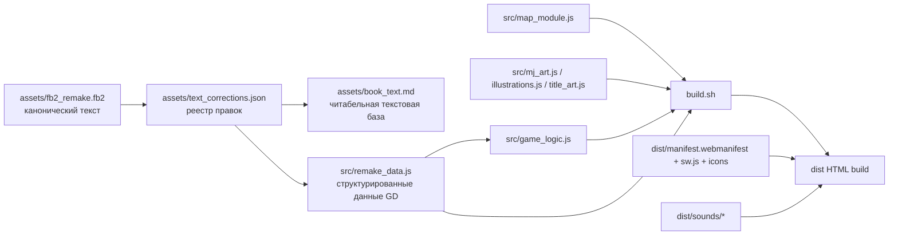
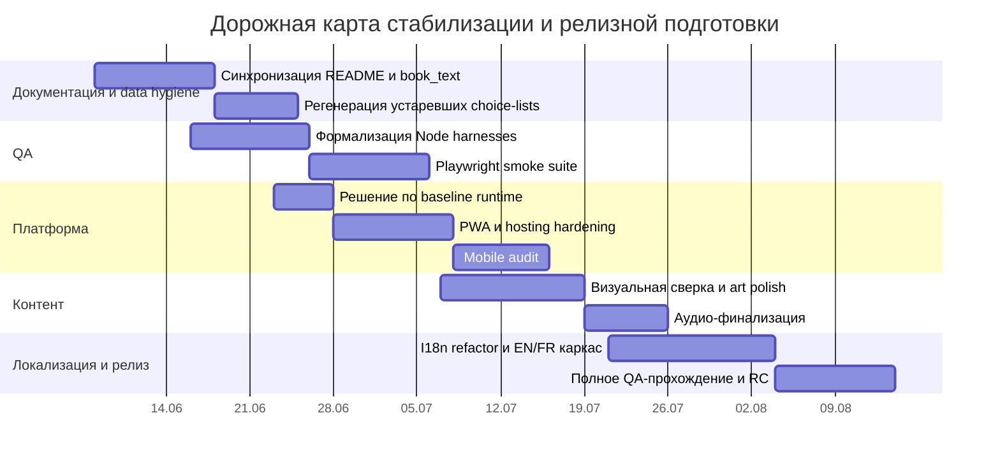

# Аналитический отчёт по проекту Подземелья Чёрного замка

## Резюме для руководителя

По доступным материалам проект уже находится не на стадии поиска концепции, а на стадии предрелизной стабилизации. Это крупная, почти завершённая цифровая адаптация русскоязычной книги-игры с 1221 параграфом, 76 боями, 60 концовками, интерактивной картой, системой инвентаря, сохранениями, набором иллюстраций и подготовленным PWA-контуром. Важнее всего то, что реестр правок фиксирует не «сырой» прототип, а длительно вычищаемую каноническую систему, где основной correctness-бэклог к началу июня 2026 года уже закрыт, а оставшаяся работа сместилась в эксплуатационный слой: синхронизацию документации с кодом, воспроизводимый QA, локализацию, mobile hardening, финальную визуально-звуковую полировку и упаковку/хостинг. fileciteturn0file4 fileciteturn0file2

Главный практический вывод: **движок сейчас менять не стоит**. У проекта уже есть содержательная ценность и накопленный доменный капитал именно в текущей data-driven web-архитектуре: правила, предметные цепочки, условные ветвления, боевые модификаторы, загадки, специальные флаги и коррекционный реестр глубоко подогнаны под канон и неоднократно верифицировались. Миграция на Twine, Ink или Godot до релиза почти наверняка даст отрицательный ROI: добавит переписывание, регрессионный риск и потерю накопленных исправлений, но не даст пропорциональной продуктовой выгоды. Гораздо выгоднее сохранить текущую основу, формализовать источники истины, выставить наружу тестовый контур и аккуратно довести упаковку, UX и локализацию. fileciteturn0file1 fileciteturn0file2 fileciteturn0file4

При этом в проекте уже видны два разных контура зрелости. Первый — **механико-канонический** — близок к завершению. Второй — **продуктово-операционный** — всё ещё не доведён: README и производные артефакты отстают от реального состояния реестра, сохранения опираются на `localStorage`, а заявленный сценарий открытия HTML напрямую с диска конфликтует с тем, что поведение `localStorage` на `file:` URL не стандартизовано и может отличаться между браузерами; кроме того, PWA-активация в любом случае потребует secure context, то есть HTTPS или `localhost`. Именно этот слой сейчас определяет реальные риски вывода проекта для пользователей. fileciteturn0file4 fileciteturn0file1 citeturn26view0turn26view1turn27view1

Отдельно отмечу ограничение исследования. Бриф прямо говорит, что прикреплённые `game_logic.js`, `text_corrections.json`, `book_text.md` и `README.md` идентичны путям в приватном GitHub-репозитории, и именно эти файлы я прочитал детально; для остальных путей ниже я опираюсь на официальную структуру и комментарии README/брифа, не выдавая их за построчно проверенный код. Это важно, потому что сам бриф отдельно предупреждает не подменять недоступный файл «анализом по памяти». fileciteturn0file0

## Что показывает репозиторий

Стартовая база исследования задаётся самим брифом: приватный репозиторий `YVashchuk/Dungeons-of-the-Black-Castle` на ветке `main`, при этом четыре приложенных файла объявлены идентичными путям в репозитории, а `src/remake_data.js` и `assets/fb2_remake.fb2` названы первичными источниками для полной проверки логики и канона. Это означает, что приложенные файлы — не «вторичные выдержки», а рабочие эквиваленты важных repo-артефактов. fileciteturn0file0

### Файлы, прочитанные напрямую

| Путь в репозитории или сессии | Статус чтения | Что содержит | Для чего нужен | Источник |
|---|---|---|---|---|
| `README.md` | Прочитан напрямую | Обзор проекта, статистика, структура репозитория, текущие TODO, стек, лицензия | Главный документ о продукте и сборке | README fileciteturn0file4 |
| `src/game_logic.js` | Прочитан напрямую через прикреплённый эквивалент `game_logic.js` | Основной JS-движок: состояние, бой, удача, заклятия, сохранения, покупки, загадки, звук, мультимедиа-полировка | Источник истины по runtime-архитектуре и UX-логике | Brief + engine file fileciteturn0file0 fileciteturn0file1 |
| `assets/text_corrections.json` | Прочитан напрямую через прикреплённый эквивалент | Канонический реестр правок, история версий, пояснения к закрытым/отложенным вопросам, pipeline данных | Самый важный governance-артефакт проекта; показывает реальное состояние бэклога | Registry fileciteturn0file2 |
| `assets/book_text.md` | Прочитан напрямую через прикреплённый эквивалент | Полный текст книги-игры, краткий corrections log, выборочная карта оригинал→ремейк | Текстовая основа проекта и материал для AI-аудитов | Book text fileciteturn0file3 |
| `PROVIDER_BRIEF_CHATGPT_2026-06-04.md` | Прочитан напрямую | Инструкции по исследованию/аудиту, маппинг прикреплённых файлов на repo paths, правила верификации | Важен как meta-spec и описание первичных источников | Provider brief fileciteturn0file0 |

### Файлы и папки, назначение которых идентифицируется по структуре репозитория

| Путь | Назначение по README/брифу | Аналитический комментарий | Источник |
|---|---|---|---|
| `PROJECT_NOTES.md` | Контекст ремейка 1991 / 1221 параграф | Вероятный документ по нумерации и расхождениям изданий | README fileciteturn0file4 |
| `QUICKSTART.md` | Быстрый старт разработчика | Нужен для онбординга и ускорения передачи проекта другому инженеру | README fileciteturn0file4 |
| `LICENSE` | Лицензия | В README указано: код адаптации — MIT; права на книгу отдельно | README fileciteturn0file4 |
| `build.sh` | Скрипт сборки `src/* → dist/` | Критически важен, потому что проект relies on ordered concatenation и сборку single-file build | README fileciteturn0file4 |
| `dist/podzemelye-chyornogo-zamka-remake.html` | Играбельный билд | Фактический runtime-артефакт для игрока | README fileciteturn0file4 |
| `dist/manifest.webmanifest` | Подготовленные метаданные PWA | PWA-контур существует, но ещё не активирован | README fileciteturn0file4 |
| `dist/sw.js` | Подготовленный Service Worker | Нужен для install/offline PWA; не активирован | README fileciteturn0file4 |
| `dist/icons/*` | PWA-иконки | Признак готовности к installable packaging | README fileciteturn0file4 |
| `dist/sounds/*` | OGG sound pack, 20 файлов | Важный факт: звук в артефактах уже внешний и файловый, а не purely inline | README fileciteturn0file4 |
| `src/game_shell_top.html` | HTML+CSS оболочка | Вероятно содержит основной layout и DOM-точки привязки UI | README fileciteturn0file4 |
| `src/remake_data.js` | `const GD = {…}` на 1221 параграф | По брифу это основной data source: choices, enemies, auto-items, gating, riddles, spell hooks; файл однострочный, что повышает сложность ревью | Brief + README fileciteturn0file0 fileciteturn0file4 |
| `src/mj_art.js` | Base64 + метаданные 42 Midjourney-иллюстраций | Крупный embedded asset layer | README fileciteturn0file4 |
| `src/illustrations.js` | 21 ч/б иллюстрация 1991, fallback | Ключевой слой визуальной деградации без потери покрытия | README fileciteturn0file4 |
| `src/title_art.js` | Линейный титульный арт | Часть брендирования и первого экрана | README fileciteturn0file4 |
| `src/map_module.js` | Модуль карты и fog-of-war | Важный UX-модуль; по коду `game_logic.js` видно, что он жёстко связан с `window.S` | README + engine comment fileciteturn0file4 fileciteturn0file1 |
| `src/mobile.css` | Подготовленные мобильные стили | Mobile track существует, но по README ещё не прошёл полноценную проверку | README fileciteturn0file4 |
| `src/fonts/*` | Self-hosted webfonts | Признак заботы о кириллице, атмосфере и offline-режиме | README fileciteturn0file4 |
| `assets/fb2_remake.fb2` | Каноничный текстовый источник | Бриф считает его идентичным по прозе `book_text.md`; именно он источник канона | Brief + registry schema fileciteturn0file0 fileciteturn0file2 |
| `assets/pdf_original_1991.pdf` | Скан первого издания | Источник справки и исторической верификации | README fileciteturn0file4 |
| `assets/analytical_report.pdf` | Аналитический отчёт Windows + Android | Признак того, что UX/platform review уже велись вне кода | README fileciteturn0file4 |
| `assets/illustrations/originals` и `web` | Мастер-изображения и веб-производные | Есть зачатки нормального asset pipeline | README fileciteturn0file4 |
| `art-pack/metadata/art_catalog.py` | Каталог артов, промпты, CDN URL, mapping | Важный bridge между худож. генерацией и runtime mapping | README fileciteturn0file4 |
| `docs/MIDJOURNEY_PROMPTS.md` | Полный набор промптов | Обеспечивает воспроизводимость AI-art pipeline | README fileciteturn0file4 |
| `docs/GRAPH_AUDIT.md` | Граф-аудит | Исторический аудит, который по реестру частично уже superseded | README + registry notes fileciteturn0file4 fileciteturn0file2 |
| `docs/PWA_IMPLEMENTATION.md` | План активации PWA | Основа для packaging workstream | README fileciteturn0file4 |
| `scripts/` | Git push helpers | Техническая служебная папка | README fileciteturn0file4 |
| `_handoff/PROJECT_BRIEF.md`, `TASKS_CHATGPT.md`, `TASKS_GEMINI.md` | Документы передачи контекста между AI-сессиями | У проекта явно выстроен AI-assisted delivery process | README fileciteturn0file4 |

Из этой инвентаризации видно, что репозиторий — это не только «игра», но и полноценный **production knowledge base**: текстовый канон, исправительный ledger, build pipeline, визуальный каталог, handoff-документы и подготовленный, но ещё не доведённый deployment-контур. Это сильная сторона проекта, потому что снижает bus factor. Но это же и риск: когда производные документы не пересобираются синхронно, они начинают расходиться с реальной базой. На практике этот drift уже наблюдается. fileciteturn0file2 fileciteturn0file4

## Продуктовая и техническая модель проекта

С продуктовой точки зрения проект решает очень чёткую задачу: **сделать цифровую, канонически верную, эстетически усиленную, offline-friendly адаптацию классической русскоязычной книги-игры**, вдохновлённой традицией Fighting Fantasy. README прямо позиционирует игру как адаптацию «Подземелий Чёрного замка» Дмитрия Браславского, работающую с ремейком первого издания 1991 года, и одновременно описывает атмосферический слой — dark Slavic fantasy, self-hosted fonts, иллюстрации, карту, журнал событий и сохранения. Из этого следует, что целевая аудитория — в первую очередь русскоязычные поклонники классических gamebook/interactive fiction практик, а также игроки, которым важны автономность, ностальгия и атмосферный текстово-визуальный опыт; вторично проект уже ориентируется на web/mobile-потребление и будущую локализацию на EN/FR. Это inference из продуктовых сигналов репозитория, а не формально записанный маркетинговый brief. fileciteturn0file4

По механике проект уже реализует существенно больше, чем «кликабельный текст». В README и движке зафиксированы канонические броски характеристик, специфические боевые правила с мульти-врагами, luck-check, штраф за побег, восемь заклятий Майлина, инвентарь с ограниченной ёмкостью, покупки, gold gating, потребление предметов, загадки с вычислением буквенных сумм, а также специальные боевые модификаторы и контекстные spell-allowlists. Это делает проект ближе к **правило-ориентированной RPG-книге**, чем к обычной гипертекстовой новелле. Дополнительно движок хранит состояние, поддерживает экспорт/импорт сейвов и использует криптографически безопасный RNG через `crypto.getRandomValues()` для `d6()`. fileciteturn0file4 fileciteturn0file1

Ключевой скрытый актив проекта — не только игровой HTML, а именно **цепочка источников истины**. В брифе `src/remake_data.js` назван data source of truth для выборов, предметов, автоматических эффектов, боёв, spell hooks и загадок; в `text_corrections.json` прямо зафиксирован pipeline `fb2_remake.fb2 → text_corrections.json → apply → remake_data.js / book_text.md`; сам реестр дополнительно предупреждает, что `book_text.md` верен как проза, но его машинно сгенерированные блоки `**Выборы:**` устарели и могут вводить аудиторов в заблуждение. Следовательно, архитектура проекта уже по факту трёхслойная: **канон → correction ledger → runtime data/engine**. Это зрелее, чем выглядит по одному только README. fileciteturn0file0 fileciteturn0file2

Эта схема не нарисована в одном месте в репозитории, но она явно собирается из README, provider brief и `schema_doc` реестра. Именно поэтому проект логично рассматривать как **data-driven gamebook platform**, а не просто как HTML-страницу с текстом. fileciteturn0file0 fileciteturn0file2 fileciteturn0file4

С технической стороны текущий runtime опирается на Vanilla JavaScript, ordered concatenation, глобальное состояние `S`, `localStorage`, DOM/UI-отрисовку, SVG-карту и аудио через файловые OGG и `Audio`, при том что в коде остался stub `AudioContext` для возможного будущего расширения. Важный нюанс: README всё ещё описывает звук как «Web Audio API» и «procedural», но `game_logic.js` уже прямо говорит, что более ранний слой осцилляторов удалён, а текущая реализация использует реальные OGG-файлы через `<audio>`. Это хороший пример того, что продукт функционально продвинулся дальше, чем документация. fileciteturn0file4 fileciteturn0file1

В результате текущий stack можно охарактеризовать так: **frontend-ориентированный, data-rich, almost dependency-free, but document-fragile**. Для этого жанра это не недостаток само по себе. Наоборот: отсутствие тяжёлого engine overhead помогает offline-first сценарию, контролю над DOM/UI, кириллической типографике и точной канонической логике. Но это становится проблемой там, где нужны модульность, reproducible tests, локализация и безопасная упаковка для PWA/релиза. fileciteturn0file1 fileciteturn0file4

## Разрывы, риски и рекомендуемые приоритеты

Самый важный разрыв проекта сегодня — не отсутствие механики, а **расхождение между артефактами сопровождения и фактическим состоянием кода/реестра**. README всё ещё говорит, например, о `text_corrections.json` как о версии `v2.48` и 29 группах, тогда как приложенный реестр обновлён 2026-06-02 и имеет более длинную историю вплоть до поздних closure passes; `book_text.md` всё ещё содержит заголовок о состоянии реестра `v2.44` и раздел «Известные пробелы / отложено», хотя сам реестр позже прямо фиксирует закрытие genuinely pending audit backlog и перенос остаточной работы в productization track. Это не косметика: именно такой drift и порождает повторные ложные аудиты, о чём реестр сам несколько раз отдельно предупреждает. fileciteturn0file3 fileciteturn0file2 fileciteturn0file4

Второй системный риск — **локализация и расширяемость сейчас зашиты в русскоязычные строки**. `getSpellId()` сначала смотрит явное поле `spell`, но затем fallback-ом вычисляет заклятие по русским ключевым подстрокам в label (`огн`, `плав`, `левит`, `сил`, `исцел` и т.д.), а предметные условия и `inventory_condition` работают через literal item names. Пока проект одноязычен, это допустимо; но план README по EN/FR локализации при такой архитектуре означает почти гарантированные дефекты, если не ввести слой внутренних идентификаторов для spells, items и condition keys. Иными словами: **локализация — не переводческий таск, а частично архитектурный рефакторинг**. fileciteturn0file1 fileciteturn0file4

Третий риск лежит в delivery-модели. Репозиторий одновременно продвигает сценарий «откройте HTML из `dist/` и играйте offline» и план по PWA. Но текущие сохранения основаны на `localStorage`, а MDN отдельно предупреждает, что на `file:` URL поведение `localStorage` не определено, varies by browser, и даже может бросать `SecurityError`; service worker же, наоборот, требует secure context, то есть HTTPS или `localhost`. Значит, проекту нужен явный продуктовый выбор: **поддерживаемый baseline — это file:// offline build, installable PWA под HTTPS, либо packaged desktop/mobile wrapper**. Пока это не зафиксировано, QA не сможет дать по-настоящему жёсткую матрицу поддержки. fileciteturn0file1 fileciteturn0file4 citeturn26view0turn26view1turn27view1

Четвёртый риск — **скрытая связность кода**. README говорит, что `build.sh` склеивает несколько файлов в определённом порядке, а сам `game_logic.js` содержит специальный bridge, объясняющий, что `map_module.js` обращается к `window.S` «в 16+ местах» и без этого silently no-ops. Это признак order-dependent глобальной архитектуры, которая хорошо работает в small-to-medium static project, но плохо переносит refactor, code splitting и автоматические toolchains без явной спецификации зависимостей. Иными словами, текущая архитектура достаточно эффективна для maintenance одним хорошо контекстуализированным разработчиком, но уязвима при расширении команды. fileciteturn0file4 fileciteturn0file1

Пятый риск — **opaque data management**. Бриф отдельно предупреждает, что `src/remake_data.js` — это гигантский однострочный файл, который нужно парсить программно; реестр при этом много раз говорит о реальных Node harness passes и проверках графа. Значит, проект уже созрел до состояния, где data layer и QA harnesses критичнее простой ручной читаемости, но в структуре репозитория из README не видно явно оформленного `tests/` или нормализованного, diff-friendly data source. Для будущего сопровождения это узкое место: тестовая дисциплина, судя по реестру, существует, а вот явный reproducible test entrypoint в repo surface area — нет. fileciteturn0file0 fileciteturn0file2 fileciteturn0file4

Шестой риск — **финальная content-QA ещё не закончена**, даже хотя механика в целом стабилизирована. README открыто перечисляет незавершённые product-события: активация PWA, замена fallback/placeholder sound layer, полное тестовое прохождение до победного §1220, локализация EN/FR и визуальная проверка всех Midjourney-артов после Batch 4. Реестр добавляет к этому пост-механические workstreams вроде mobile audit и map nodes. Это важное уточнение: «основной backlog закрыт» не означает «проект готов к публичному релизу». fileciteturn0file4 fileciteturn0file2

| Разрыв или риск | Почему это важно | Наблюдаемый симптом | Приоритет |
|---|---|---|---|
| Drift документации относительно реестра и кода | Будущие аудиты и handoff-сессии будут повторно находить уже закрытые вопросы | `README.md` и `book_text.md` отстают от `text_corrections.json` | Высокий |
| Локализация через русские строки | EN/FR нельзя безопасно добавить без архитектурной подготовки | keyword-based spell detection и literal item names | Высокий |
| Неясный baseline runtime | QA и релиз зависят от того, поддерживаем ли мы `file://`, HTTPS PWA или wrapper | `localStorage` на `file:` и PWA/Service Worker не совпадают по требованиям | Высокий |
| Глобальная order-dependent сборка | Усложняет поддержку, онбординг и масштабирование | `build.sh` + `window.S` bridge для map module | Средне-высокий |
| Непрозрачный data layer | Трудно делать code review и диффы контента | `remake_data.js` однострочный и gigantic | Средне-высокий |
| QA harness не оформлен как surface repo artifact | Снижает воспроизводимость для нового исполнителя | Реестр ссылается на Node harnesses, но README их не показывает | Средний |
| Документированная аудио-архитектура расходится с фактической | Ведёт к неправильным техническим решениям и ожиданиям | README говорит о Web Audio/procedural, код — о OGG + `<audio>` | Средний |
| Контент-полировка ещё открыта | Может бить по perception quality и достоверности | TODO по full playthrough, art review, PWA, localisation | Средний |

Практический приоритетный порядок я бы сформулировал так. Сначала — **синхронизация источников истины**: README, `book_text.md` header/meta, текущие статистики, явный release note о фактическом состоянии звука, а также regeneration устаревших `**Выборы:**` блоков из актуального `remake_data.js`. Затем — **формализация test surface**: выделенный `tests/` каталог, `npm`/`node` entrypoint, smoke suite и Playwright E2E. После этого — **platform hardening**: решение по baseline runtime, HTTPS-hosted PWA или lightweight wrapper. Только затем логично делать **локализационный refactor**, потому что без ID-based data model перевод быстро начнёт ломать gating logic. fileciteturn0file2 fileciteturn0file3 fileciteturn0file4 citeturn23view1turn27view1

## Сравнение технологических вариантов

Для этого проекта нельзя сравнивать инструменты абстрактно; их нужно мерить о текущую реальность: already-working canonical logic, large corrected content graph, offline reading pattern, tight coupling with Russian text, and near-finished mechanics. Поэтому таблицы ниже — не «что вообще популярнее», а **что даст наилучший ROI именно здесь**. fileciteturn0file1 fileciteturn0file2 fileciteturn0file4

### Варианты движка и narrative layer

| Вариант | Что это даёт | Плюсы именно для этого проекта | Минусы и риски | Вывод |
|---|---|---|---|---|
| **Оставить текущий Vanilla JS + data-driven engine** | Полный контроль над DOM/UI, offline build, прямое соответствие уже накопленному ledger | Низкий migration risk; уже реализованы сложные канонические механики, инвентарь, бои, загадки, спеллы, покупки, карта; стек понятен из репо | Нужны doc sync, test formalization и localization refactor; глобальная связность требует дисциплины | **Рекомендованный основной путь**. fileciteturn0file1 fileciteturn0file2 fileciteturn0file4 |
| **Twine 2** | Open-source tool for interactive nonlinear stories; публикует прямо в HTML, допускает variables, CSS и JS | Быстрое authoring/UI для гипертекста, удобно для менее технических редакторов | Придётся перевыразить уже существующую каноническую механику, боевую математику, карту, сейвы и correction-driven data model; это migration, а не улучшение | Подходит скорее для новых, более простых историй или прототипов, не для mid-project migration. citeturn24view5 |
| **Ink + Inky** | Narrative scripting language for games; export to JSON; задумана как middleware, встраиваемая в game engine | Сильный вариант, если проект позднее станет платформой для нескольких книг-игр; хорошо отделяет authoring от runtime | Для текущего проекта даст большой upfront refactor; надо строить новый runtime bridge к уже существующей логике | Хорош как **стратегия следующего поколения**, но не как short-term замена текущего движка. citeturn23view2 |
| **Godot Web** | Browser export через HTML5/WebAssembly/WebGL 2.0; полноценный editor/runtime | Сильный editor tooling, packaging discipline, хорош для более богатых 2D-проектов | Web export имеет ограничения по threading, audio и platform constraints; для mostly text/UI project overhead непропорционален пользе | Не рекомендую до релиза; рассматривать только если проект превратится в более визуально-игровой продукт. citeturn25view0turn25view1turn25view2 |

Вывод по этому блоку простой: **не мигрировать стек до релиза**. Если думать на один шаг дальше текущей книги, то наиболее стратегический апгрейд — не Godot, а переход к более формальной authoring-модели вроде Ink, но только после того, как нынешний проект будет завершён и зафиксирован как stable baseline. fileciteturn0file2 citeturn23view2

### Варианты библиотек, сборки и QA

| Область | Вариант | Что даёт | Подходит ли проекту |
|---|---|---|---|
| Сборка | `build.sh` как сейчас | Максимальная простота, прозрачная single-file сборка | Подходит сейчас, но требует документированной зависимости по порядку файлов. fileciteturn0file4 |
| Сборка | **esbuild** | Extremely fast bundler; built-in JS/CSS/JSON support, source maps, watch, plugins | Лучший минимально-инвазивный upgrade path: быстро, просто, без тяжёлого framework mindset. citeturn23view3 |
| Сборка | Vite | Fast dev server, modern build flow, plugins, optimized production output | Стоит брать, если нужен полноценный dev UX с HMR и structured plugin ecosystem; для небольшого статического проекта может быть избыточен. citeturn21view2 |
| Графика/2D-слой | DOM + SVG как сейчас | Достаточно для текстовой игры, карты и fog-of-war | Оставить базовым вариантом. fileciteturn0file4 |
| Графика/2D-слой | PixiJS | Officially positions itself as flexible HTML5 2D WebGL renderer | Нужен только если карта, частицы и animated scene overlays резко усложнятся; не обязателен для current scope. citeturn21view0 |
| Аудио runtime | Native `<audio>` как сейчас | Простота и нулевая внешняя зависимость | Для небольшого fantasy gamebook это нормальный baseline. fileciteturn0file1 |
| Аудио runtime | howler.js | Unified JS audio API, audio sprites, Web Audio by default with HTML5 fallback | Имеет смысл, если появятся проблемы с overlapping SFX, pooling, loop management и mobile quirks. citeturn21view1 |
| Регрессионный QA | Node harnesses + `node --check` | Уже фактически используются по журналу правок | Их нужно просто сделать видимыми и воспроизводимыми в repo surface area. fileciteturn0file2 |
| E2E QA | **Playwright** | Cross-browser automation for Chromium/Firefox/WebKit, auto-waiting, tracing, parallelism | Сильнейший кандидат для smoke/E2E набора: creation flow, saves, combat, PWA, localization toggles. citeturn23view1 |

Мой выбор здесь следующий. Для кода — **esbuild как следующий pragmatic step**, а не немедленный переход на Vite. Для QA — **Node regression harnesses как уровень канонической логики плюс Playwright как пользовательский слой**. Для аудио — **оставаться на native audio до появления реальных pain points**, но держать Howler в резерве. Для рендеринга — **не тащить PixiJS без доказанной потребности**. citeturn23view3turn23view1turn21view1turn21view0

### Варианты art и audio pipeline

| Pipeline | Плюсы | Минусы | Рекомендация |
|---|---|---|---|
| **Текущий**: Midjourney + curated mapping + fallback scans + web derivatives | Уже работает; есть 42 art IDs, web-версии, prompt archive, art catalog | Требует финальной visual QA и более строгой лицензийной/production-дисциплины по итоговым ассетам | Сохранить как основу до релиза. fileciteturn0file4 |
| **Гибридный**: Midjourney base + paint-over/cleanup в Krita + managed export profiles | Даёт более единый art direction и лучшее поверхностное качество; Krita — free/open-source professional painting tool | Требует ручной художественной работы и арт-лида | **Лучший баланс** для финальной доводки ключевых сцен и титула. citeturn28view0 |
| **Полностью ручной**: авторские иллюстрации без AI base | Максимальный контроль над стилем и правами | Самый дорогой и длинный путь, нерационален для near-release проекта | Реалистичен только для long-term definitive edition. |
| **Текущий звук**: OGG pack + native playback | Уже есть, легко self-hosted, не ломает offline flow | Нужны финальная унификация loudness/loop hygiene/credits discipline | Довести, не выбрасывая. fileciteturn0file1 fileciteturn0file4 |
| **Редактура звука через Audacity** | Free/open-source audio editor with import/export and plugin support | Не решает sourcing сам по себе, а только обработку | Практичный production tool для нормализации, trimming, batch export и финального OGG/WAV пакета. citeturn28view1 |

По art/audio я бы не менял стратегию, а **ужёсточал pipeline**: мастер-ассет, production derivative, mapping spreadsheet/catalog, credit/license sheet, regression checklist на соответствие сцене. Иными словами, проекту сейчас нужен не «другой инструмент», а более строгая production-операционка вокруг уже выбранных инструментов. fileciteturn0file4

## Дорожная карта и состав команды

Исходя из имеющихся материалов, рациональная дорожная карта — это не six-month reinvention, а **10–12 недель организованной стабилизации**. При этом бюджет, точный размер команды и финальные платформы в материалах не зафиксированы, поэтому ниже я даю roadmap в относительных категориях усилий, а не в FTE-бюджетах.

| Этап | Что делаем | Основной результат | Усилие | Ключевые роли |
|---|---|---|---|---|
| Синхронизация источников истины | Обновить `README.md`, header/meta в `book_text.md`, статистики, звуковое описание, explicit source-of-truth policy; регенерировать устаревшие блоки `**Выборы:**` из актуального data layer | Документация снова совпадает с реальным кодом и реестром | Среднее | Tech lead, content editor, producer |
| Формализация QA-контура | Вынести Node harnesses в видимый `tests/` слой, добавить команды запуска, smoke checks и baseline snapshots | Повторяемая регрессия без знания всей истории проекта | Высокое | Tech lead, QA engineer |
| Браузерный E2E | Поднять Playwright smoke suite: new game, rolls, spells, inventory, combat, save/export-import, map, hash-navigation | Пользовательский слой верифицируется автоматически в Chromium/Firefox/WebKit | Среднее | QA engineer, frontend engineer |
| Platform hardening | Зафиксировать baseline: `file://` build, HTTPS PWA и/или wrapper; довести manifest, service worker, cache policy, update flow | Понятная модель поставки и поддержки | Высокое | Frontend engineer, DevOps/web owner, producer |
| Mobile audit | Проверить iPhone/Android layouts, safe areas, typographic scale, touch hit areas, scroll, map modal | Реальная mobile readiness вместо подготовленного, но непроверенного CSS | Среднее | Frontend engineer, QA engineer |
| Localization refactor | Ввести внутренние ID для spells/items/conditions, отделить runtime keys от UI strings, подготовить i18n layer | Архитектурно безопасная база под EN/FR | Высокое | Frontend engineer, localization architect |
| Арт-ревью | Scene-by-scene визуальная сверка MJ/scan mapping, paint-over ключевых сцен, финальная consistency polish | Снижение визуального шума и несоответствий сценам | Среднее | Art director, illustrator |
| Аудио-финализация | Нормализация/чистка SFX, credit ledger, финальные loop/volumes, optional howler evaluation only if needed | Production-grade sound pack | Низкое–среднее | Audio designer |
| Полное прохождение и release candidate | Manual full playthroughs, fail states, ending coverage, save compatibility, release notes | Версия-кандидат на публичный релиз | Высокое | QA lead, producer, content tester |

Эта диаграмма не претендует на фиксированный календарь команды, но отражает логически правильный порядок зависимостей: сначала truth sync, потом tests, затем packaging/runtime decision, и лишь после этого безопасная локализация и release candidate. Такой порядок следует из наблюдаемой структуры рисков в репозитории и из требований web platform к PWA/service worker. fileciteturn0file2 fileciteturn0file4 citeturn27view1turn24view0

Минимальный рекомендуемый состав команды я бы видел так. Нужен **один технический владелец фронтенда/архитектуры**, потому что текущее решение сильно data- и order-dependent. Нужен **контент-редактор/канон-ревьюер**, который понимает издания и не ломает correction ledger. Нужен **QA-инженер или QA-аналитик**, который умеет сочетать ручные прохождения с автоматизацией Playwright/Node. Нужен **арт-лид или художник на полировку**, потому что финальный риск по визуалу — это уже не генерация, а consistency review. Для выпуска локализации дополнительно нужен **редактор-переводчик**, потому что здесь перевод затрагивает механику. fileciteturn0file1 fileciteturn0file2 fileciteturn0file4

## Вопросы для стейкхолдеров

Ниже — не формальные «nice to have», а вопросы, без ответа на которые часть решений останется предположительной.

| Область | Открытый вопрос |
|---|---|
| Платформы | Какой baseline считаем обязательным: браузер с диска (`file://`), HTTPS-hosted web/PWA, packaged desktop app, Android wrapper, или комбинацию? |
| Права | Каков точный правовой режим текста книги, сканов 1991 года, Midjourney-derived art и будущих локализаций? Нужно ли подтверждённое release-rights clearance до публичного релиза? |
| Качество | Что считаем «достаточным» для релиза: full-canon correctness, polished presentation, или и то и другое? Что важнее при конфликте — абсолютная верность канону или UX-упрощение? |
| Аудит | Нужно ли сохранить correction ledger и AI-audit handoff как постоянную часть production process, или после релиза проект должен перейти на более традиционный QA-flow? |
| Локализация | EN/FR — это UI-only, UI+боевой интерфейс, или полный перевод книги? Должны ли предметы и заклятия иметь stable internal IDs, не зависящие от языка, уже в ближайшем релизе? |
| Звук | Остаёмся на curated CC0/CC-BY pack, заказываем оригинальный sound design, или допускаем минималистичный soundscape? Насколько критична атмосфера звука для релиза? |
| Визуал | Финальная версия оставляет Midjourney как production art, или ключевые сцены нужно обязательно дописать вручную/pain-over? |
| Поддержка сейвов | Есть ли требование сохранять совместимость между версиями сейвов после будущих refactor и локализации? Если да, какая политика миграций считается обязательной? |
| Analytics/privacy | Нужна ли вообще какая-либо телеметрия, или продукт должен оставаться полностью offline/private without analytics footprint? |
| Accessibility | Нужны ли обязательные функции доступности: масштаб текста, высококонтрастный режим, клавиатурная навигация, screen-reader support, упрощённая карта? |
| Продуктовый горизонт | Это единичная адаптация конкретной книги или заготовка под reusable engine для следующих gamebook-проектов? |
| Release channel | Планируется ли тихий web release для узкого круга, публичный GitHub Pages/PWA релиз, фестивальный билд, либо коммерческое издание? |

Если суммировать всё в одной фразе: **проекту уже не нужен новый концепт; ему нужна дисциплина финализации**. Самое ценное, что у него уже есть, — это не только игра, но и накопленная каноническая база знаний. Самое опасное, что у него сейчас есть, — это рассинхронизация между этой базой и поверхностными документами, через которые в проект будут входить новые люди, новые AI-сессии и будущие QA-циклы. Поэтому ближайшая цель — не «переписать», а **зафиксировать, синхронизировать, протестировать и выпустить без потери накопленного знания**. fileciteturn0file2 fileciteturn0file4